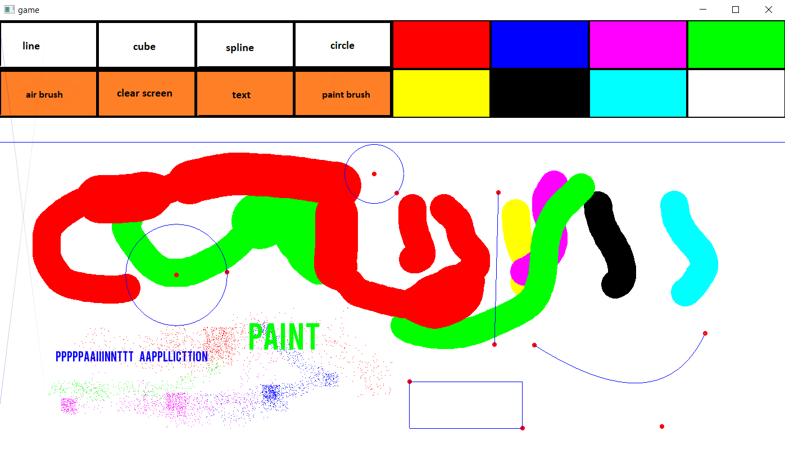

# Paint-Clone
A simple paint clone (lesser features) written in C++ with the SFML library.
  
  
  
## Using the program    
Visual Studio 2017 is used. Download the file and uncrompress it, and run Paint.sln.
  
## Performance Note
I was also using the project to practice some manual memory management, hence the performance may not be optimal as the entities are heap allocated.

## Features  
The program's features include:  
> text  
> airbrush  
> paint  
> basic 2D shapes  
> colour palette  
> clear screen function  
> undo function

## Using Features (Entities)  
### text
To use text, click on the text box and type away. To resize the font, Use the Up ad Down Buttons. To change text colour, click on colour palette. To put text onto canvas, press Enter.  
  
### airbrush
To use airbrush, press the airbrush box. To spray the brush, press 'A'. To resize the brush, Use the Up ad Down Buttons. To change brush colour, click on colour palette.

### basic 2D shapes
Click on desired shape to use shape. To draw and drag the shape, right click and drag th node (red in colour), and left click to place the node in place. For splines, use the middle button first to place the second node, then use left click for the third node. The nodes can be clicked again to resize afterwards. **Shapes are not supported by colour**.    
  
### undo
press CTRL + Z to undo.

### clear screen  
press the clear screen box to clear the screen.  

